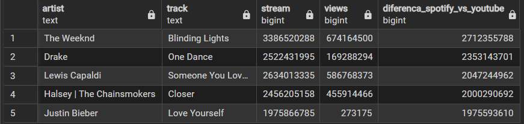

# Análise de Métricas Musicais e Engajamento (Spotify & YouTube)

> 
> 
>

---

## 1. Introdução e Contexto do Projeto

Este projeto representa um mergulho profundo no universo da análise de dados musicais, utilizando um dataset híbrido que combina métricas técnicas da API do Spotify com dados de popularidade de vídeos do YouTube. O objetivo principal não foi apenas responder a perguntas de negócio, mas sim demonstrar um fluxo de trabalho analítico completo e profissional, desde a estruturação inicial dos dados em PostgreSQL até a otimização de consultas.

Ao longo desta análise, identifiquei e tratei problemas de qualidade de dados, explorei as características que definem a "personalidade" das músicas e desenvolvi queries complexas para extrair insights que não eram óbvios à primeira vista. A narrativa deste projeto foi estruturada para simular um desafio real de análise de dados, onde o pensamento crítico e a capacidade de adaptar a metodologia foram tão importantes quanto a proficiência técnica em SQL.


## 2. Objetivo Principal

O objetivo deste projeto foi duplo:

* **Técnico:** Demonstrar proficiência em todo o ciclo de vida de um projeto de dados em ambiente SQL, incluindo:
    * **Modelagem de Dados:** Criação de um schema robusto e otimizado no PostgreSQL.
    * **Análise Exploratória (EDA):** Investigação sistemática para entender a estrutura, as distribuições e os vieses do dataset.
    * **Limpeza de Dados (Data Cleaning):** Tratamento de dados inválidos e consolidação de registros duplicados para garantir a integridade da análise.
    * **Análise de Dados com SQL Avançado:** Uso de CTEs, Funções de Janela (`PARTITION BY`, `DENSE_RANK`, `SUM() OVER()`) e agregações complexas para responder a perguntas de negócio.
    * **Otimização de Consultas:** Diagnóstico de performance com `EXPLAIN ANALYZE` e solução com a criação de Índices.

* **Analítico:** Utilizar o dataset para extrair insights sobre a popularidade e as características de faixas musicais, estabelecendo as bases para futuros projetos de Business Intelligence e Machine Learning.


## 3. Ferramentas e Tecnologias Utilizadas

* **Banco de Dados:** PostgreSQL
* **IDE / Cliente SQL:** pgAdmin 4
* **Linguagem:** SQL (PostgreSQL dialect)

## 4. Estrutura do Projeto

O projeto está organizado em diretórios e scripts sequenciais para refletir um fluxo de trabalho de dados claro, modular e reprodutível. A estrutura abaixo serve como um mapa para a navegação no repositório.

```
/analise-spotify-youtube
|
|-- dataset/                <-- Pasta para armazenar os dados
|   |-- cleaned_dataset.csv
|
|-- images/                 <-- Pasta para armazenar imagens e prints para o README
|
|-- sql/                    <-- Pasta com todos os scripts SQL do projeto
|   |-- 01_schema.sql       # Criação da estrutura da tabela no PostgreSQL
|   |-- 02_eda.sql          # Scripts para a análise exploratória dos dados
|   |-- 03_cleaning.sql     # Scripts para a limpeza e tratamento dos dados
|   |-- 04_analysis.sql     # Queries da análise principal (perguntas de negócio)
|   |-- 05_optimization.sql # Demonstração de otimização de consulta com índices
|
|-- LICENSE                 <-- A licença de uso do código e do projeto
|-- README.md               <-- A documentação principal do projeto que você está lendo

```


## 5. A Jornada Técnica: Do Dado Bruto ao Insight

Esta seção detalha o processo técnico completo, dividido nos blocos de código SQL que compõem este projeto. Cada bloco representa uma etapa lógica no ciclo de vida da análise de dados, com o código-fonte detalhado disponível nos respectivos arquivos `.sql` do repositório.


### 5.1. Bloco 01: Criação da Estrutura (Schema)

**Objetivo:** A primeira etapa foi definir uma estrutura de tabela robusta e semanticamente correta no PostgreSQL. Uma base bem estruturada é o alicerce para qualquer análise de dados confiável.

**Decisões e Boas Práticas Adotadas:**

* **Tipos de Dados Específicos:** Em vez de usar tipos genéricos, optei por `REAL` para métricas musicais e `BIGINT` para contagens de alta cardinalidade (`views`, `stream`), demonstrando um entendimento sobre otimização de armazenamento e a natureza dos dados.
* **Restrições de Integridade:** Apliquei restrições `NOT NULL` em colunas essenciais (`artist`, `track`, `stream`) para garantir a integridade dos dados desde o início.
* **Ordem das Colunas:** A ordem das colunas no `CREATE TABLE` foi definida para espelhar exatamente a ordem do arquivo `.csv` de origem, garantindo uma ingestão de dados correta e sem falhas.

> *O código SQL completo para a criação da tabela está documentado no arquivo `sql/01_schema.sql`.*


### 5.2. Bloco 02: Análise Exploratória de Dados (EDA)

**Objetivo:** Antes de responder a qualquer pergunta de negócio, a etapa de EDA foi fundamental para "conversar" com os dados. O objetivo foi entender a sua estrutura, a distribuição, identificar anomalias e descobrir as "personalidades" escondidas no dataset.

**Principais Descobertas (Insights da EDA):**

1.  **A Natureza Híbrida do Dataset:** A análise da coluna `most_played_on` revelou que o dataset não era puramente do Spotify, mas sim uma combinação de dados do Spotify e do YouTube. Essa descoberta foi estratégica e levou à decisão de renomear e redefinir o escopo do projeto.
2.  **Identificação de Dados Inválidos:** Investiguei a qualidade dos dados e encontrei registros com valores fisicamente impossíveis, como `duration_min = 0` e `tempo = 0`, que foram marcados para remoção.
3.  **Descoberta de Duplicatas:** A EDA revelou um problema de qualidade de dados significativo: a mesma faixa musical aparecia em múltiplas linhas, atribuída a artistas ligeiramente diferentes.

Todas essas descobertas foram documentadas e serviram como a justificativa direta para as ações tomadas na etapa seguinte.

> *Todas as queries utilizadas para esta exploração estão disponíveis no arquivo `sql/02_eda.sql`.*


### 5.3. Bloco 03: Limpeza de Dados (Data Cleaning)

**Objetivo:** Com os problemas e anomalias identificados na Análise Exploratória, esta etapa foi dedicada a tratar cada um deles de forma sistemática para garantir a integridade e a consistência do dataset.

**Processos de Limpeza Executados:**

* **Consolidação de Faixas Duplicadas:** Para resolver o problema de duplicatas, implementei um processo robusto que agrupou os registros idênticos, combinou os nomes dos artistas em um único campo (usando `|` como separador seguro) e substituiu as várias linhas duplicadas por um único registro "mestre".
* **Remoção de Dados Inválidos:** Registros com `duration_min = 0` e `tempo = 0` foram removidos, pois representam valores fisicamente impossíveis que distorceriam qualquer análise estatística.
* **Remoção de Dados Irrelevantes:** Faixas com `stream = 0` foram excluídas para focar a análise na popularidade e engajamento, que são o cerne do projeto.

> *A implementação de todas estas regras de limpeza, com verificações "antes e depois", pode ser encontrada no script `sql/03_cleaning.sql`.*


### 5.4. Bloco 04: Análise dos Dados (Analysis)

Esta seção é o coração do projeto. Aqui, eu utilizei o dataset limpo e consolidado para responder a uma série de perguntas de negócio, estruturadas em capítulos para contar uma história sobre os dados. O objetivo foi demonstrar não apenas a extração de dados, mas a capacidade de gerar insights acionáveis e comunicar descobertas de forma clara.

> *Todas as queries detalhadas para esta seção estão disponíveis no arquivo `sql/04_analysis.sql`.*

---
#### **Capítulo 1: O Panorama Geral (Agregações Fundamentais)**
*Comecei a análise do macro para o micro, entendendo primeiro a estrutura geral do dataset e os principais grupos de interesse.*

**Pergunta 1: Qual a distribuição de faixas por artista no dataset?**
* **Objetivo:** Investigar a distribuição para identificar a estrutura do dataset e potenciais vieses de coleta, uma etapa crítica antes de prosseguir com análises de ranking.
* **Insight:** A análise revelou um forte viés, com cerca de **27% dos artistas** possuindo exatamente 10 faixas. Isso indicou que o dataset foi provavelmente construído a partir de "Top 10s", uma descoberta crucial para contextualizar todas as análises de ranking subsequentes.

**Pergunta 2: Quais são os álbuns mais populares?**
* **Objetivo:** Identificar os álbuns com maior engajamento agregado (soma de streams) para responder a uma pergunta de negócio fundamental sobre quais projetos musicais foram mais consumidos.
* **Insight:** Ao agregar os streams por álbum, foi possível criar um ranking claro dos projetos mais populares. Esta análise serve como base para entender quais álbuns geram mais valor de consumo na plataforma.

---
#### **Capítulo 2: Os Grandes Sucessos (Ranking e Segmentação de Popularidade)**
*Após a visão geral, foquei nos destaques individuais e nas comparações de alto nível para identificar as faixas de maior impacto.*

**Pergunta 3: Quais faixas pertencem ao "Clube do Bilhão" de streams?**
* **Objetivo:** Segmentar e identificar um grupo de elite de faixas que atingiram o marco de 1 bilhão de streams, representando os maiores sucessos globais presentes no dataset.
* **Insight:** A consulta isolou um grupo seleto de faixas que representam o ápice da popularidade, sendo um excelente ponto de partida para analisar as características comuns dos maiores hits.

**Pergunta 4: Quais faixas dominam em cada plataforma (Spotify vs. YouTube)?**
* **Objetivo:** Comparar diretamente a popularidade de cada faixa nas duas plataformas para identificar quais músicas performam melhor em cada ecossistema.
* **Insight:** Criei uma métrica de "diferença" para rankear as faixas com maior dominância em cada plataforma. Isso revelou dois perfis distintos de sucesso: faixas que são "hinos de streaming" no Spotify e outras que são "fenômenos visuais" no YouTube.
---
>
> 
>
---
>
> 
>
---

#### **Capítulo 3: O DNA Musical (Análise Profunda dos Atributos)**
*Neste capítulo, mergulhei nos detalhes técnicos da música para entender as características sonoras que definem as faixas do nosso dataset.*

**Pergunta 5: Quais são os extremos de cada atributo musical?**
* **Objetivo:** Explorar sistematicamente os extremos de cada um dos 9 atributos musicais (ex: Danceability, Energy). Ao identificar o Top 5, o Bottom 5 e a Média de cada atributo, criei um perfil detalhado da diversidade sonora do dataset.
* **Insight:** Esta análise revelou os perfis sonoros extremos presentes na plataforma, desde as faixas mais dançantes e energéticas até as mais calmas e acústicas, servindo como uma base fundamental para a futura criação de playlists temáticas.

**Pergunta 6: Quais álbuns possuem a maior diversidade sonora?**
* **Objetivo:** Criar uma métrica derivada (`range` de energia) para quantificar a diversidade sonora *dentro* de cada álbum.
* **Insight:** A análise identificou os álbuns que oferecem a maior "jornada" sonora, variando de faixas muito calmas a muito energéticas. Este é um critério de recomendação valioso para ouvintes que apreciam dinamismo em um álbum.

---
#### **Capítulo 4: Técnicas Avançadas de SQL (Análises Contextuais e de Ranking)**
*Finalizei a análise com demonstrações de técnicas SQL sofisticadas para resolver perguntas de negócio complexas que exigem funções de janela.*

**Pergunta 7: Quais são as 3 faixas mais populares de cada artista?**
* **Objetivo:** Demonstrar a capacidade de criar rankings segmentados, utilizando a função de janela `PARTITION BY`.
* **Insight:** Em vez de um ranking global, esta análise forneceu um "Top 3" personalizado para cada artista, uma técnica fundamental para sistemas de recomendação e relatórios personalizados.

**Pergunta 8: Como o engajamento (likes) se acumula com a popularidade?**
* **Objetivo:** Calcular a soma cumulativa de `likes` ao longo do ranking de popularidade, demonstrando como o engajamento se concentra nas faixas do topo.
* **Insight:** A análise provou visualmente o "Princípio de Pareto" (regra 80/20) nos dados, mostrando que uma pequena porcentagem das faixas mais vistas acumula a vasta maioria dos likes, um insight crucial para estratégias de marketing e promoção.

**Pergunta 9: Quais são as faixas que se destacam por serem "ao vivo"?**
* **Objetivo:** Usar uma métrica agregada (a média geral de `Liveness`) como um baseline para segmentar o dataset e identificar faixas que se destacam em relação à norma.
* **Insight:** A consulta filtrou com sucesso um conjunto de faixas com alta probabilidade de serem gravações ao vivo, demonstrando uma técnica eficaz para encontrar outliers positivos com base em uma característica específica.


### 5.5. Bloco 05: Otimização de Consulta (Query Optimization)

**Objetivo:** Para concluir a jornada técnica, o foco mudou da análise dos dados para a **eficiência do acesso** a eles. Esta etapa demonstra uma abordagem proativa em relação à performance, simulando um caso de uso comum – buscar as faixas de um artista específico – e otimizando a consulta para garantir uma resposta rápida e eficiente.

**O Processo de Otimização em 3 Passos:**

1.  **Diagnóstico (Baseline):** Utilizei o comando `EXPLAIN ANALYZE` para gerar um plano de execução da consulta *antes* de qualquer otimização. A análise revelou que o PostgreSQL estava realizando um `"Sequential Scan"`, ou seja, lendo a tabela inteira linha por linha para encontrar os dados, o que é altamente ineficiente para tabelas grandes.

2.  **Solução (Criação de Índice):** Com base no diagnóstico, a solução foi criar um **Índice B-Tree** na coluna `artist`. Um índice funciona como o índice de um livro, permitindo que o banco de dados localize os dados de um artista específico de forma quase instantânea, sem precisar varrer toda a tabela.

3.  **Verificação (Validação do Resultado):** Executei novamente o mesmo `EXPLAIN ANALYZE` após a criação do índice. O novo plano de execução confirmou o uso de um `"Index Scan"`, com uma redução drástica no custo computacional e no tempo de execução da consulta.

> **[SUGESTÃO DE IMAGEM]**
>
> **Onde:** Após o item 3 da lista acima.
>
> **O quê:** Este é o lugar perfeito para um print comparativo. Tire um print do resultado do `EXPLAIN ANALYZE` **antes** do índice e outro **depois**. Coloque as duas imagens lado a lado para mostrar visualmente a diferença no plano de execução e, principalmente, a diminuição no `execution time`.
>
> ``

**Conclusão da Otimização:** Este ciclo de diagnóstico, solução e verificação não apenas provou a eficácia do índice, mas também demonstrou uma competência fundamental em engenharia de dados: a capacidade de identificar gargalos de performance e resolvê-los de forma metódica.

> *O script completo com o ciclo de otimização está disponível no arquivo `sql/05_optimization.sql`.*
